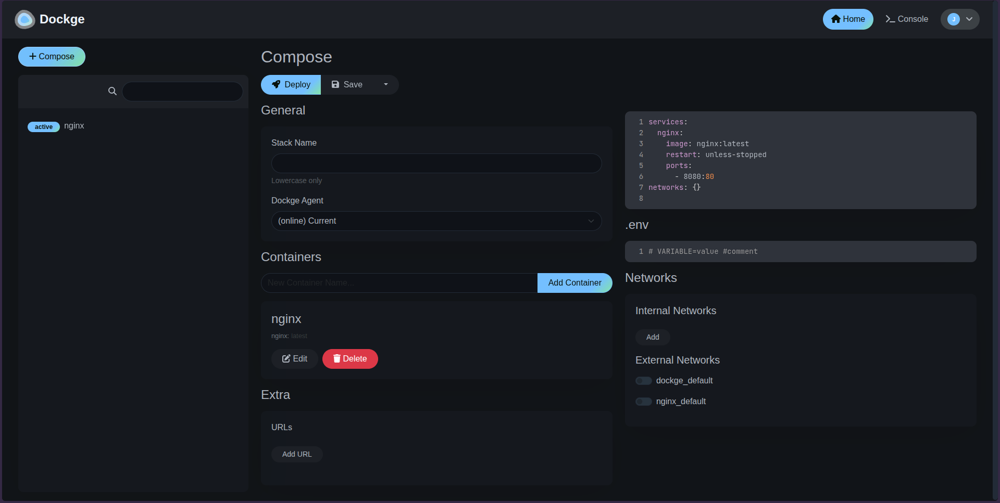

# Dockge en openEuler con Podman



Ejecutar Dockge en openEuler 24.03 LTS-SP4 utilizando Podman.

Esta guía utiliza los paquetes disponibles en openEuler y adapta la configuración oficial de Dockge para trabajar con Podman.

## Requisitos

- openEuler 24.03 LTS-SP4
- Podman
- podman-docker
- Python 3
- podman-compose

Dockge requiere Docker 20+ o Podman, podman-docker. Para instalaciones con Podman.

**Referencia:**  
https://github.com/louislam/dockge

## Instalación

### Instalar Podman

Primero podemos comprobar qué versiones están disponibles en los repositorios de openEuler:

```bash
dnf info podman podman-docker
```

Para revisar la transacción antes de instalar:

```bash
sudo dnf install podman podman-docker --assumeno
```

Instalamos los paquetes:

```bash
sudo dnf install -y podman podman-docker
```

Comprobamos la instalación:

```bash
podman --version
docker --version
```

`podman-docker` proporciona compatibilidad con la CLI de Docker utilizando Podman como motor.

**Referencia:**  
https://podman.io/docs/installation

### Instalar podman-compose

Podman puede utilizar un proveedor externo para ejecutar archivos Compose. En esta instalación utilizaremos `podman-compose`.

```bash
pip3 install podman-compose
```

Si el ejecutable se instala dentro de `~/.local/bin` y esa ruta no está en el `PATH`:

```bash
echo 'export PATH="$HOME/.local/bin:$PATH"' >> ~/.bashrc
source ~/.bashrc
```

Comprobamos:

```bash
podman-compose --version
podman compose version
```

**Referencias:**  
https://github.com/containers/podman-compose  
https://docs.podman.io/en/latest/markdown/podman-compose.1.html

### Habilitar el socket de Podman

En esta guía Dockge se comunica con Podman mediante el socket del usuario.

Primero habilitamos `linger`:

```bash
sudo loginctl enable-linger "$USER"
```

Después iniciamos el socket:

```bash
systemctl --user enable --now podman.socket
```

Comprobamos su estado:

```bash
systemctl --user status podman.socket
```

Y verificamos que exista:

```bash
ls -l "$XDG_RUNTIME_DIR/podman/podman.sock"
```

Normalmente la ruta será similar a:

```text
/run/user/1000/podman/podman.sock
```

El número corresponde al UID del usuario y puede comprobarse con:

```bash
id -u
```

**Referencia:**  
https://docs.podman.io/en/latest/markdown/podman-system-service.1.html

### Crear los directorios de Dockge

Dockge utiliza `/opt/stacks` como directorio predeterminado para almacenar los stacks.

```bash
sudo mkdir -p /opt/stacks /opt/dockge
sudo chown -R "$USER":"$USER" /opt/stacks /opt/dockge
```

Entramos al directorio:

```bash
cd /opt/dockge
```

La estructura utilizada será:

```text
/opt/
├── dockge/
│   ├── compose.yaml
│   └── data/
└── stacks/
```

**Referencia:**  
https://github.com/louislam/dockge

## compose.yaml

El archivo oficial de Dockge está preparado principalmente para Docker, por lo que necesitamos algunos cambios para utilizarlo con Podman.

```yaml
services:
  dockge:
    image: docker.io/louislam/dockge:1
    restart: unless-stopped

    ports:
      - 5001:5001

    security_opt:
      - label=disable

    volumes:
      - ${XDG_RUNTIME_DIR}/podman/podman.sock:/var/run/docker.sock
      - ./data:/app/data:Z
      - /opt/stacks:/opt/stacks:Z

    environment:
      - DOCKGE_STACKS_DIR=/opt/stacks
```

Los principales cambios respecto al archivo oficial son:

- Se utiliza la imagen completa `docker.io/louislam/dockge:1`.
- `/var/run/docker.sock` se reemplaza por el socket de Podman.
- Se utiliza `${XDG_RUNTIME_DIR}` para evitar colocar un UID fijo.
- Los volúmenes de datos utilizan `:Z` para trabajar con SELinux.
- Se añade `label=disable` para permitir que Dockge acceda al socket de la API de Podman.

El archivo Compose original puede consultarse aquí:

**Referencia:**  
https://github.com/louislam/dockge/blob/master/compose.yaml

## SELinux

En openEuler SELinux puede estar en modo `Enforcing`.

Podemos comprobarlo con:

```bash
getenforce
```

También podemos revisar las etiquetas de los directorios:

```bash
ls -ldZ /opt/dockge/data /opt/stacks
```

Podman permite utilizar `:Z` en los bind mounts para aplicar una etiqueta SELinux privada al contenido utilizado por el contenedor.

Por eso utilizamos:

```yaml
- ./data:/app/data:Z
- /opt/stacks:/opt/stacks:Z
```

Para el acceso al socket de Podman también utilizamos:

```yaml
security_opt:
  - label=disable
```

**Referencias:**  
https://docs.podman.io/en/latest/markdown/podman-run.1.html  
https://docs.podman.io/en/latest/markdown/podman-system-service.1.html

## Iniciar Dockge

Desde `/opt/dockge`:

```bash
podman compose up -d
```

Comprobamos el contenedor:

```bash
podman compose ps
```

También podemos verlo directamente con:

```bash
podman ps
```

Para revisar los logs:

```bash
podman logs --tail 50 dockge_dockge_1
```

Probamos el servicio desde openEuler:

```bash
curl -I http://127.0.0.1:5001
```

Una respuesta correcta debe mostrar:

```text
HTTP/1.1 200 OK
```

Dockge utiliza el puerto `5001` de forma predeterminada.

**Referencia:**  
https://github.com/louislam/dockge

## Firewall

Si Dockge funciona localmente pero no puede abrirse desde otro equipo, comprobamos primero las zonas activas:

```bash
sudo firewall-cmd --get-active-zones
```

Después verificamos si el puerto `5001/tcp` está permitido en la zona correspondiente.

Ejemplo para la zona `public`:

```bash
sudo firewall-cmd --zone=public --query-port=5001/tcp
```

Si es necesario:

```bash
sudo firewall-cmd --zone=public --permanent --add-port=5001/tcp
sudo firewall-cmd --reload
```

La zona debe cambiarse si la interfaz utiliza una diferente a `public`.

**Referencia:**  
https://firewalld.org/documentation/howto/open-a-port-or-service.html

## Acceso

Podemos consultar la dirección IP de openEuler con:

```bash
ip -br address
```

Después abrimos:

```text
http://IP_DEL_SERVIDOR:5001
```

Por ejemplo:

```text
http://192.168.122.119:5001
```

## Cómo actualizar

Entramos al directorio de Dockge:

```bash
cd /opt/dockge
```

Descargamos una versión más reciente de la imagen:

```bash
podman compose pull
```

Y recreamos el contenedor:

```bash
podman compose up -d
```

## Solución de problemas

### `podman compose` no encuentra un proveedor

Si aparece un error indicando que no existe un proveedor Compose:

```bash
podman-compose --version
```

Si no está instalado:

```bash
pip3 install podman-compose
```

**Referencia:**  
https://github.com/containers/podman-compose

### `systemctl --user` muestra `No medium found`

Durante la instalación puede ocurrir que:

```bash
systemctl --user enable --now podman.socket
```

devuelva:

```text
Failed to connect to bus: No medium found
```

Comprueba:

```bash
echo "$XDG_RUNTIME_DIR"
```

y:

```bash
rpm -q systemd-pam
```

Si `systemd-pam` no está instalado, comprueba primero que esté disponible:

```bash
dnf info systemd-pam
```

Después puede instalarse con:

```bash
sudo dnf install systemd-pam
```

Tras iniciar una nueva sesión o reiniciar el sistema:

```bash
echo "$XDG_RUNTIME_DIR"
```

debería devolver una ruta similar a:

```text
/run/user/1000
```

### Podman no puede resolver `louislam/dockge:1`

Puede aparecer:

```text
short-name "louislam/dockge:1" did not resolve to an alias
```

En ese caso utilizamos el nombre completo de la imagen:

```text
docker.io/louislam/dockge:1
```

### Dockge reinicia constantemente con `EACCES`

En los logs puede aparecer:

```text
EACCES: permission denied, open 'data/db-config.json'
```

Comprueba SELinux:

```bash
getenforce
```

y las etiquetas:

```bash
ls -ldZ /opt/dockge/data /opt/stacks
```

Los volúmenes utilizados en esta guía incluyen `:Z`:

```yaml
- ./data:/app/data:Z
- /opt/stacks:/opt/stacks:Z
```

Después de modificar el archivo:

```bash
podman compose down
podman compose up -d
```

## Referencias

- Dockge: https://github.com/louislam/dockge
- Podman: https://podman.io/
- podman-compose: https://github.com/containers/podman-compose
- openEuler: https://www.openeuler.org/
